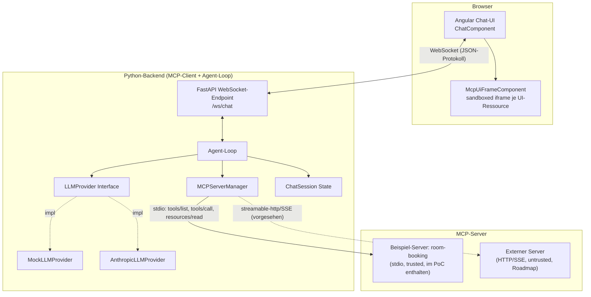
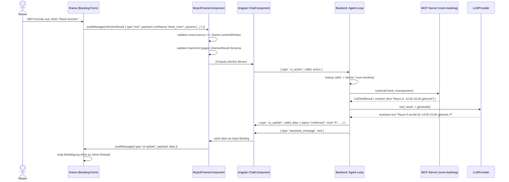
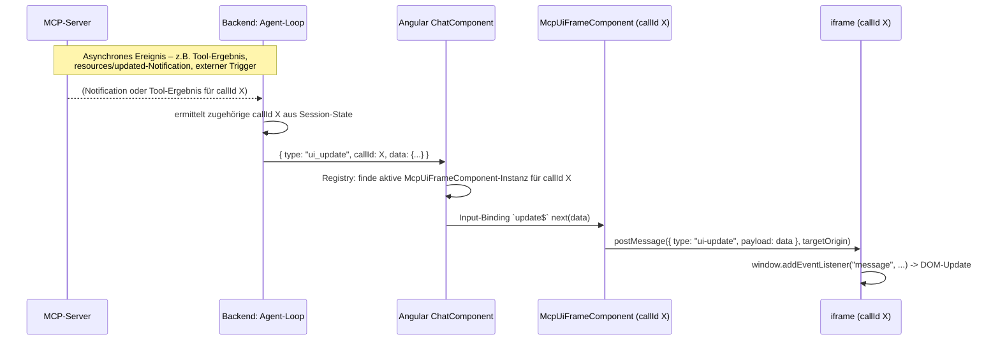

# Konzept: MCP Apps (UI) in der Chat-Applikation

Status: Entwurf / PoC-Begleitdokument
Datum: 2026-06-14

## 0. Recherchestand & Versionspinning

Diese Recherche wurde am 2026-06-14 durchgeführt. Das MCP-Apps-Ökosystem ist jung und
ändert sich schnell – die folgenden Versionen sind die zu diesem Zeitpunkt aktuellen,
verifizierten Stände und werden im PoC gepinnt:

| Komponente | Paket | Version (gepinnt) | Quelle / Bemerkung |
|---|---|---|---|
| MCP-Spec-Erweiterung "Apps" | `modelcontextprotocol/ext-apps` (SEP-1865) | Spec-Snapshot `2026-01-26` (+ `draft`) | Noch nicht Teil der Kern-Spec, aktiver Entwurf |
| MCP Python SDK | `mcp` | `1.27.2` | PyPI, benötigt Python ≥3.10 |
| MCP-UI Server SDK (Python) | `mcp-ui-server` | `1.0.0` (intern `__version__ = 5.2.0`) | PyPI, benötigt Python ≥3.10, `pip install mcp-ui-server` |
| MCP-UI Client SDK (TS) | `@mcp-ui/client` | `7.1.1` | npm, peer deps: `@modelcontextprotocol/ext-apps ^1.2.0`, `@modelcontextprotocol/sdk ^1.27.1`, `zod ^3.23.8` |
| Frontend Framework | `@angular/core` / `@angular/cli` | `22.0.1` (PoC nutzt `21.2.15`) | npm, aktuelle Major-Version; Angular 22 benötigt Node `>=22.22.3`, im PoC-Umfeld stand nur Node `22.22.2` zur Verfügung – Angular 21 (`^20.19.0 \|\| ^22.12.0 \|\| >=24.0.0`) ist API-kompatibel (Standalone Components, Signals) und wurde stattdessen verwendet (siehe `README.md`) |
| LLM SDK (optionaler Real-Provider) | `anthropic` | `0.109.1` | PyPI |
| Backend Webframework | `fastapi` + `uvicorn[standard]` | aktuell (siehe `backend/pyproject.toml`) | WS-Endpoint |

### Offene Annahmen (Stand der Recherche)

1. **SEP-1865 ist noch nicht final.** Die Spec liegt als Pull-Request/Working-Draft im
   Repo `modelcontextprotocol/ext-apps` vor (Snapshot `2026-01-26` + `draft`-Ordner).
   Feldnamen (`_meta.ui.resourceUri`, `_meta.ui.visibility`, `_meta.ui.csp`,
   `ui/notifications/*`) können sich noch ändern. Wir richten uns nach dem
   `2026-01-26`-Snapshot, dokumentieren aber explizit, wo wir von ihm abweichen.
2. **`mcp-ui-server` 1.0.0 setzt für `rawHtml`-Inhalte den MIME-Type `text/html`**, nicht
   `text/html;profile=mcp-app` (das von SEP-1865 geforderte Format). Im PoC überschreiben
   wir den MIME-Type beim Registrieren der `ui://`-Ressource explizit, um SEP-1865-konform
   zu sein, nutzen aber `create_ui_resource()` für Validierung/Metadaten-Encoding
   (`mcpui.dev/ui-*`-Metadaten, `UIActionResult`-Helfer).
3. **`@mcp-ui/client` 7.1.1 ist primär auf React ausgerichtet** (`AppRenderer`,
   `AppFrame`, `UIResourceRenderer` als React-Komponenten). Eine Web-Component-Variante
   (`<ui-resource-renderer>`) existiert, wird in der offiziellen Doku aber als "Legacy"
   bezeichnet, und die neuere Apps-SDK-Architektur (doppeltes Sandbox-iframe,
   `AppBridge`) ist für Nicht-React-Hosts noch nicht klar dokumentiert.
   → **Entscheidung**: Für den PoC bauen wir eine **eigene, schlanke Angular-Komponente**
   (`McpUiFrameComponent`), die das **stabile, dokumentierte `UIActionResult`-
   postMessage-Protokoll** von MCP-UI implementiert (`tool` / `prompt` / `link` /
   `intent` / `notify`). Dieses Protokoll ist das, was die von `mcp-ui-server`
   generierten HTML-Ressourcen tatsächlich per `window.parent.postMessage(...)` senden,
   und es ist transportneutral (reines `postMessage`+JSON). Damit ist die Lösung sowohl
   mit MCP-UI- als auch mit zukünftigen SEP-1865-Apps-Hosts kompatibel, ohne von einer
   noch unreifen React-zentrierten Bibliothek abhängig zu sein. Serverseitig (Tool-
   Metadaten, `ui://`-Ressourcen, MIME-Type) richten wir uns dennoch nach SEP-1865, damit
   ein zukünftiger Umstieg auf `AppRenderer`/`AppFrame` (sobald für Angular nutzbar) ohne
   Protokollbruch im Backend möglich ist.
4. **Content-Typen im PoC**: `rawHtml` (via `srcdoc`) wird vollständig unterstützt und ist
   der Haupt-Pfad. `externalUrl` (`text/uri-list`, iframe `src`) wird im Renderer
   ebenfalls unterstützt (für das Sicherheitsmodell relevant), aber vom Beispiel-Server
   nicht verwendet. `remoteDom` wird **nicht** implementiert (siehe Risiken/Roadmap) – es
   erfordert eine Remote-DOM-Runtime im iframe, die den PoC-Rahmen sprengen würde.
5. **Transport Backend↔Frontend**: WebSocket (Begründung siehe Abschnitt 5).
6. **MCP-Server-Transport im PoC**: Der Beispiel-Server wird per **stdio** als
   Subprozess vom Backend gestartet (kein externer Netzwerk-Dependency nötig). Die
   `MCPServerManager`-Abstraktion im Backend ist transport-agnostisch (stdio und
   `streamable-http`/SSE für echte externe Server vorgesehen), im PoC ist aber nur ein
   stdio-Server konfiguriert.
7. **LLM-Provider**: Hinter einem Interface `LLMProvider`. Default ist ein
   `MockLLMProvider` (deterministische Zustandsmaschine, kein API-Key nötig). Ein
   `AnthropicLLMProvider` (Modell `claude-sonnet-4-6`, Tool-Use über die Messages-API)
   ist als zweite Implementierung vorhanden und wird aktiviert, wenn `ANTHROPIC_API_KEY`
   gesetzt ist.
8. **Beispiel-Anwendungsfall**: "Meeting-Room-Booking" – ein Tool liefert ein
   interaktives Buchungsformular (UI-Ressource), das Absenden löst einen Folge-Tool-Call
   aus, dessen Ergebnis per Backend-Push in das offene iframe zurückgespielt wird
   (Buchungsbestätigung inline).

---

## 1. Ziele, Scope, Nicht-Ziele

### Ziele

- MCP-Tools können **interaktive UI-Ressourcen** (Formulare, Dashboards, Charts)
  liefern, die **inline im Chat** gerendert werden.
- Die UI kommuniziert **bidirektional** mit dem Agenten: Nutzeraktionen in der UI lösen
  Folge-Tool-Calls aus; Ergebnisse/Updates werden in die laufende UI zurückgespielt.
- Die Architektur unterstützt **mehrere MCP-Server**, inkl. **externer/fremder Server**,
  deren UI-Ressourcen **nicht vertrauenswürdig** sind.
- Klare **Split-Host-Verantwortlichkeiten**: Python-Backend = Agent/MCP-Client/Secrets,
  Angular = Renderer/Mediator, keine LLM-Logik oder Secrets im Frontend.
- Ein **Sicherheitsmodell**, das Sandbox-iframes, CSP, Origin-Validierung und
  Trust-Level für externe Server beschreibt und im PoC minimal umsetzt.

### Scope (PoC)

- 1 Python-Backend (FastAPI, WebSocket) mit Agent-Loop, MCP-Client-Manager,
  abstrahiertem LLM-Provider.
- 1 Beispiel-MCP-Server (Python, FastMCP + `mcp-ui-server`) mit UI-Tool(s).
- 1 Angular-Frontend mit Chat-UI und sandboxed iframe-Renderer.
- End-to-End-Roundtrip: Prompt → Tool-Call → UI rendert → Nutzeraktion → Folge-Tool-Call
  → Ergebnis sichtbar (Chat + iframe-Update).
- Security-Baseline: iframe-Sandbox, `srcdoc`, minimale CSP, `postMessage`-
  Origin-/Schema-Validierung, Trust-Level-Konfiguration pro Server.

### Nicht-Ziele (PoC)

- Keine Produktions-Authentifizierung/Multi-Tenancy.
- Keine Persistenz von Chat-Verläufen (In-Memory pro WS-Session).
- Kein `remoteDom`-Rendering.
- Keine horizontale Skalierung / Sticky-Session-Infrastruktur (siehe Risiken).
- Keine vollständige SEP-1865-Sandbox-Proxy-Architektur (Double-iframe) – wird als
  Roadmap-Punkt dokumentiert.
- Kein echter externer/fremder MCP-Server angebunden (aus Testbarkeitsgründen), aber
  die Architektur ist dafür ausgelegt und wird beschrieben.

---

## 2. Grundlagen

### 2.1 MCP Apps / SEP-1865 (Kurzfassung)

SEP-1865 ("MCP Apps – Interactive User Interfaces for MCP") erweitert MCP um:

- **UI-Ressourcen**: vordeklarierte Ressourcen unter dem URI-Schema `ui://...`
  (z. B. `ui://room-booking-server/booking-form`), mit MIME-Type
  `text/html;profile=mcp-app`. Inhalt wird über den Standard-`resources/read`-Call
  geladen (als Text oder Base64-Blob).
- **Tool-UI-Verknüpfung**: Tools referenzieren ihre UI-Ressource über
  `tool._meta.ui.resourceUri`. Zusätzlich kann `_meta.ui.visibility` steuern, ob ein Tool
  für das Modell (`"model"`), die App/UI (`"app"`) oder beide sichtbar ist (Default:
  beide).
- **Bidirektionale Kommunikation**: Die im iframe gerenderte UI kommuniziert mit dem Host
  über **JSON-RPC 2.0 via `postMessage`** – mit MCP-typischen Methoden
  (`tools/call`, `resources/read`, `ui/open-link`, `ui/message`,
  `ui/request-display-mode`, `ui/update-model-context`) sowie Host→View-Notifications
  (`ui/notifications/tool-input`, `ui/notifications/tool-result`,
  `ui/notifications/host-context-changed`, `ui/notifications/size-changed`, ...).
- **Sicherheitsmodell**: Pflicht-Sandboxing aller UI-Inhalte, CSP basierend auf
  deklarierten Domains (`_meta.ui.csp.{connectDomains,resourceDomains,frameDomains,
  baseUriDomains}`), restriktiver Default (`connect-src 'none'`), und für Web-Hosts ein
  "Sandbox-Proxy"-Doppel-iframe (Host-Origin ≠ Sandbox-Origin).

### 2.2 MCP-UI (mcpui.dev) – das "ältere", breiter etablierte Projekt

**MCP-UI** (`@mcp-ui/server`, `@mcp-ui/client`, Python: `mcp-ui-server`) ist ein
eigenständiges, etwas älteres SDK-Projekt, das UI-Ressourcen **direkt als Teil des
Tool-Ergebnisses** (`CallToolResult.content`, als `EmbeddedResource` mit `uri`-Präfix
`ui://`) ausliefert – ohne zwingenden separaten `resources/read`-Schritt. Es definiert
drei Content-Typen:

| Content-Typ | MIME-Type | Rendering |
|---|---|---|
| `rawHtml` | `text/html` | iframe `srcdoc` |
| `externalUrl` | `text/uri-list` | iframe `src` |
| `remoteDom` | `application/vnd.mcp-ui.remote-dom+javascript; framework={react|webcomponents}` | Remote-DOM-Runtime im iframe |

Zusätzlich definiert MCP-UI das **`UIActionResult`-Protokoll** – die Nachrichten, die die
gerenderte HTML-Seite per `postMessage` an den Host sendet:

```ts
type UIActionResult =
  | { type: "tool";   payload: { toolName: string; params: Record<string, any> }, messageId?: string }
  | { type: "prompt"; payload: { prompt: string }, messageId?: string }
  | { type: "link";   payload: { url: string }, messageId?: string }
  | { type: "intent"; payload: { intent: string; params: Record<string, any> }, messageId?: string }
  | { type: "notify"; payload: { message: string }, messageId?: string }
```

### 2.3 MCP-UI vs. Apps-Standard – Verhältnis im PoC

SEP-1865 standardisiert (und erweitert) im Kern das, was MCP-UI bereits etabliert hat:
`ui://`-Ressourcen, iframe-Rendering, Sandbox-Pflicht. Der wesentliche Unterschied ist,
dass SEP-1865 die **Tool→Ressourcen-Verknüpfung über `_meta.ui.resourceUri` +
`resources/read`** formalisiert (statt die Ressource inline im Tool-Ergebnis
einzubetten) und ein volles **JSON-RPC-Protokoll** für die iframe↔Host-Kommunikation
definiert (während MCP-UI nur die `UIActionResult`-Nachricht für "View → Host" kennt).

**Unsere Strategie**: Wir übernehmen die **SEP-1865-Konventionen serverseitig**
(`_meta.ui.resourceUri`, `ui://`-Ressource via `resources/read`, MIME
`text/html;profile=mcp-app`), nutzen aber für die **iframe↔Frontend-Kommunikation** das
schlankere, bereits implementierte **MCP-UI-`UIActionResult`-Protokoll**. Das Backend
übersetzt eingehende `UIActionResult`-Nachrichten (`type: "tool"`) 1:1 in MCP
`tools/call`-Aufrufe – das ist exakt die Übersetzung, die ein vollständiger SEP-1865-Host
ebenfalls vornehmen würde, nur ohne das volle JSON-RPC-Envelope. Damit ist der PoC ein
**Vorgriff auf einen SEP-1865-Host mit reduziertem Wire-Format**, der bei Bedarf
schrittweise auf das volle JSON-RPC-Protokoll (und `AppRenderer`/`AppFrame`) migriert
werden kann (vgl. Roadmap, Abschnitt 11).

---

## 3. Zielarchitektur

### 3.1 Komponentendiagramm



### 3.2 Sequenzdiagramm (a): Tool-Call mit UI-Ergebnis

```mermaid
sequenceDiagram
    actor U as Nutzer
    participant FE as Angular (Chat + McpUiFrame)
    participant BE as Backend: Agent-Loop
    participant LLM as LLMProvider
    participant MCP as MCP-Server (room-booking)

    U->>FE: "Ich möchte einen Meetingraum buchen"
    FE->>BE: { type: "user_message", text }
    BE->>LLM: generate(messages, tools[])
    LLM-->>BE: tool_call: show_booking_form()
    BE->>BE: callId = uuid4()
    BE->>MCP: tools/call show_booking_form
    MCP-->>BE: CallToolResult { content: [text "Formular bereit"] }
    BE->>BE: tool-Definition hat _meta.ui.resourceUri = "ui://room-booking/booking-form"
    BE->>MCP: resources/read ui://room-booking/booking-form
    MCP-->>BE: { mimeType: "text/html;profile=mcp-app", text: "<html>...</html>" }
    BE->>FE: { type: "ui_resource", callId, resource, sandbox }
    FE->>FE: render <iframe sandbox srcdoc=...>
    BE->>LLM: tool_result -> generate()
    LLM-->>BE: assistant text "Hier ist das Formular, bitte ausfüllen"
    BE->>FE: { type: "assistant_message", text }
```

### 3.3 Sequenzdiagramm (b): UI-Aktion zurück in den Loop



### 3.4 Sequenzdiagramm (c): Backend-Push/Notification in den iframe

Zeigt den Fall, dass eine Aktualisierung **nicht** durch eine unmittelbare UI-Aktion im
selben Request-Response-Zyklus ausgelöst wird, sondern asynchron (z. B. Folge-Ereignis
eines Tools, Server-Notification, oder – wie im PoC – das Ergebnis des in (b)
ausgelösten Folge-Tool-Calls, das unabhängig vom ursprünglichen `ui_resource` über den
Kanal gepusht wird):



---

## 4. Split-Host-Verantwortlichkeiten

| Verantwortung | Python-Backend | Angular-Frontend |
|---|:---:|:---:|
| Verbindung zu MCP-Servern (stdio/HTTP/SSE) | ✅ | ❌ |
| `tools/list`, `tools/call`, `resources/read` | ✅ | ❌ |
| Erkennung von UI-Tools (`_meta.ui.resourceUri`) | ✅ | ❌ |
| LLM-Aufrufe & Agent-Loop | ✅ | ❌ |
| Secrets (API-Keys, Server-Credentials) | ✅ | ❌ (nie) |
| Trust-Level / Allowlist je MCP-Server | ✅ | ❌ |
| Ableitung der CSP-Direktiven aus `_meta.ui.csp` | ✅ (berechnet) | ✅ (setzt `<meta>`-CSP im iframe-Dokument um) |
| Korrelation Tool-Call ↔ UI-Ressource ↔ UI-Aktion (`callId`) | ✅ (vergibt & verwaltet) | ✅ (reicht `callId` durch) |
| iframe-Rendering (`sandbox`, `srcdoc`/`src`) | ❌ | ✅ |
| Empfang & Validierung von `postMessage` (Origin, Schema) | ❌ | ✅ |
| Übersetzung `UIActionResult` → WS-Nachricht | ❌ | ✅ |
| Re-Injektion von Daten-Updates in laufendes iframe | ❌ | ✅ |
| Konversations-/Session-State | ✅ | ❌ (nur Anzeige/Cache für laufende Session) |
| Host-Context (Theme, Locale, Display-Mode) | ✅ (liefert Werte) | ✅ (wendet CSS-Variablen/Theme an, sendet bei Bedarf Änderungen) |
| Graceful Degradation (kein UI-Support) | ✅ (kann reinen Text liefern) | ✅ (Fallback-Rendering als Text/Link) |

---

## 5. Transport Backend ↔ Frontend

### 5.1 Optionen

| Option | Bewertung |
|---|---|
| **HTTP-Polling** | Einfachste Umsetzung, aber hohe Latenz für `ui_update`-Pushes, viele Requests, schlecht für "Live"-Charakter der UI-Updates. **Verworfen.** |
| **SSE (Server-Sent Events)** | Gut für Server→Client-Push (assistant_message, ui_resource, ui_update), aber Client→Server (user_message, ui_action) benötigt einen **separaten HTTP-Endpoint**. Zwei Kanäle → zusätzliche Korrelation/State-Synchronisation, kein natives Request/Response auf einer Verbindung. |
| **WebSocket** ✅ | Eine bidirektionale Verbindung pro Chat-Session. Niedrige Latenz für UI-Aktionen (wichtig für "Live-Feel" interaktiver UIs), einfache 1:1-Zuordnung Session↔Connection, gut geeignet auch für künftiges Token-Streaming der LLM-Antwort. |

**Entscheidung: WebSocket** (`/ws/chat`), ein JSON-Nachrichtenprotokoll mit
`type`-Discriminator. Begründung: Die UI-Interaktionen (Formular absenden → Folge-Tool
→ Update im iframe) sollen sich "live" anfühlen; ein einziger Kanal vereinfacht
Vermittlung von `callId`-Korrelationen erheblich. Nachteil (siehe Risiken): WebSockets
benötigen bei horizontaler Skalierung Sticky Sessions oder einen externen
Session-/Event-Store – für den PoC (Single-Instance) irrelevant.

### 5.2 Nachrichtenprotokoll

`callId` (UUID4, vom Backend vergeben) korreliert: einen `tools/call`, die daraus
resultierende `ui_resource`, alle `ui_action`-Nachrichten aus diesem iframe, und alle
`ui_update`-Pushes in dieses iframe.

**Client → Server**

| `type` | Felder | Beschreibung |
|---|---|---|
| `user_message` | `text: string` | Neue Chat-Nachricht des Nutzers |
| `ui_action` | `callId: string`, `action: UIActionResult` | Vom iframe gemeldete Aktion (siehe 2.2) |

**Server → Client**

| `type` | Felder | Beschreibung |
|---|---|---|
| `assistant_message` | `text: string` | Antworttext des Agenten |
| `tool_call` | `callId, server, tool, args` | Transparenz: Agent ruft Tool auf (Anzeige im Chat-Verlauf, z. B. "🔧 ruft `book_room` auf…") |
| `tool_result` | `callId, server, tool, isError, summary` | Transparenz: Ergebnis eines Tool-Calls |
| `ui_resource` | `callId, server, resource: {uri, mimeType, text?, blob?}, sandbox: SandboxPolicy` | Neue UI-Ressource zum Rendern |
| `ui_update` | `callId, data: Record<string, unknown>` | Daten-Push in ein bereits gerendertes iframe |
| `status` | `state: "thinking" \| "idle"` | UI-Hinweis (Spinner) |
| `error` | `message: string` | Fehler (z. B. Tool-Call fehlgeschlagen, Server nicht erreichbar) |

`SandboxPolicy` (vom Backend pro `ui_resource` berechnet, siehe Abschnitt 7):

```ts
interface SandboxPolicy {
  sandboxAttributes: string;     // z.B. "allow-scripts allow-forms"
  csp: string;                   // fertige Content-Security-Policy für <meta>-Tag
  trustLevel: "trusted" | "untrusted";
}
```

---

## 6. Angular-Rendering

### 6.1 Entscheidung: eigene `McpUiFrameComponent` statt `@mcp-ui/client`-Webcomponent

Begründung siehe Annahme 3 (Abschnitt 0). Die Komponente implementiert exakt das
`UIActionResult`-Protokoll (Abschnitt 2.2), das auch `@mcp-ui/client` intern verwendet –
ein späterer Wechsel auf `<ui-resource-renderer>` oder `AppRenderer`/`AppFrame` ist damit
ohne Protokolländerung im Backend möglich (Austausch nur auf Komponentenebene).

### 6.2 API der Komponente

```ts
@Component({ selector: 'mcp-ui-frame', ... })
export class McpUiFrameComponent {
  @Input({ required: true }) resource!: UiResourceMessage['resource'];
  @Input({ required: true }) sandbox!: SandboxPolicy;
  @Input() update$?: Observable<Record<string, unknown>>; // ui_update Stream für diese callId
  @Output() action = new EventEmitter<UIActionResult>();
}
```

### 6.3 iframe-Lifecycle

1. **Aufbau des Dokuments**: Der rohe HTML-String aus der `ui_resource`-Nachricht wird
   **nicht** unverändert übernommen. Die Komponente injiziert:
   - ein `<meta http-equiv="Content-Security-Policy" content="...">`-Tag (aus
     `sandbox.csp`) als erstes Element in `<head>`,
   - optional `window.__MCP_UI_INITIAL_DATA__ = {...}` (aus
     `_meta["mcpui.dev/ui-initial-render-data"]`, falls vorhanden) vor allen anderen
     Skripten,
   - ein kleines Bootstrap-Skript, das `ResizeObserver` auf `document.body` registriert
     und Größenänderungen per `postMessage({type:"ui-size-changed", payload:{height}})`
     meldet, sowie einen `window.addEventListener("message", ...)`-Handler, der
     `ui-update`-Nachrichten vom Host entgegennimmt und ein `CustomEvent("mcp-ui-update")`
     auf `document` dispatcht (damit die UI-Ressource selbst nur einen einfachen
     `EventListener` registrieren muss).
2. **Rendering**: `iframe.srcdoc = wrappedHtml`,
   `sandbox="allow-scripts allow-forms"` (kein `allow-same-origin`, kein
   `allow-popups`, kein `allow-top-navigation`), `referrerpolicy="no-referrer"`.
3. **Resize**: Auf `ui-size-changed`-Nachrichten reagiert die Komponente mit Anpassung
   von `iframe.style.height` (innerhalb konfigurierbarer Min/Max-Grenzen).
4. **Render-Daten-Update (`ui_update`)**: `update$` (Observable, von
   `ChatComponent` anhand `callId` an die richtige Instanz weitergereicht) →
   `iframe.contentWindow.postMessage({type:"ui-update", payload: data}, "*")`. Da das
   iframe wegen `sandbox` ohne `allow-same-origin` eine **opaque origin** hat, ist
   `targetOrigin: "*"` hier unvermeidbar (es gibt keine adressierbare Origin) – das
   Risiko ist akzeptabel, da das iframe selbst keine sensiblen Daten besitzt, die durch
   Mit-Lauschen exponiert würden, und der Inhalt ohnehin vom Host stammt.
5. **Teardown**: Bei Entfernen der Komponente (`ngOnDestroy`) wird der
   `message`-Listener entfernt und das iframe aus dem DOM entfernt (keine
   `ui/resource-teardown`-Notification im PoC, siehe Roadmap).

---

## 7. Sicherheitsmodell

Da **fremde MCP-Server** angebunden werden können, ist deren HTML **grundsätzlich
nicht vertrauenswürdig**. Das Sicherheitsmodell hat daher mehrere Schichten:

### 7.1 iframe-`sandbox`

Default (für `trustLevel: "untrusted"` und `"trusted"` gleich, siehe 7.4):

```html
<iframe sandbox="allow-scripts allow-forms" referrerpolicy="no-referrer" ...>
```

- **Kein `allow-same-origin`**: Das iframe erhält eine **opaque origin**. Dadurch kann
  der iframe-Inhalt nicht auf `document.cookie`, `localStorage` o.ä. der Host-Origin
  zugreifen – selbst bei `srcdoc`, das ohne `sandbox` die Origin des Elternfensters
  erben würde.
- **Kein `allow-popups`, kein `allow-top-navigation`, kein `allow-modals`**: verhindert
  Phishing-Patterns (`window.open`, `top.location = ...`, `alert`-Spam).
- **`allow-forms`** wird benötigt, damit `<form>`-basierte UI-Ressourcen (unser
  Buchungsformular) funktionieren.
- Zusätzliche Capabilities (Kamera, Mikrofon, Clipboard, Geolocation) werden **nicht**
  per Default über das `allow`-Attribut gewährt. Falls eine UI-Ressource solche
  Capabilities deklariert (`_meta.ui.permissions`, SEP-1865-Erweiterung, im PoC nicht
  genutzt), müsste der Host das **explizit pro Ressource und nach Feature-Detection /
  Nutzerzustimmung** freischalten – im PoC bewusst nicht implementiert (kein Tool
  benötigt es), aber als Erweiterungspunkt in `SandboxPolicy.sandboxAttributes`
  vorgesehen.

### 7.2 Content-Security-Policy (CSP)

Das Backend berechnet pro `ui_resource` eine CSP-Direktive aus
`_meta.ui.csp.{connectDomains,resourceDomains,frameDomains}` (falls vom Server
deklariert) und einem **restriktiven Default**, falls keine Angaben vorhanden sind:

```
default-src 'none';
script-src 'unsafe-inline';
style-src 'unsafe-inline';
img-src data:;
connect-src 'none';
frame-src 'none';
form-action 'none';
```

Deklariert eine Ressource z. B. `connectDomains: ["https://api.example.com"]`, wird
`connect-src` entsprechend erweitert – **nie weiter als der Default**, d. h. das
Frontend darf die vom Backend berechnete CSP nicht aufweichen, nur identisch
übernehmen (`<meta http-equiv="Content-Security-Policy">` im iframe-Dokument). Das
Backend ist die "Quelle der Wahrheit" für die Policy, weil nur es die
`_meta.ui.csp`-Deklaration und den Trust-Level des Servers kennt.

> ⚠️ **Hinweis (CSP via `<meta>` im `srcdoc`-Dokument ist Best-Effort)**: Ein
> `<meta http-equiv="Content-Security-Policy">`-Tag in einem `srcdoc`-Dokument wird von
> aktuellen Browsern angewendet, ist aber **kein vollständiger Ersatz** für einen
> CSP-`Response`-Header (z. B. greift `frame-ancestors` dort nicht). Für `externalUrl`-
> Ressourcen (eigene Origin) ist der `<meta>`-Ansatz nicht nutzbar – hier muss der
> Server selbst entsprechende Header setzen; der Host kann nur über `sandbox` und
> `allow`-Listen (welche `externalUrl`-Domains überhaupt geladen werden dürfen)
> steuern. Für Produktionsreife ist die in SEP-1865 beschriebene **Sandbox-Proxy**-
> Architektur (separate Origin, volle Header-Kontrolle) der robustere Ansatz
> (Roadmap Phase 2).

### 7.3 `postMessage`-Origin-Validierung

Da gesandboxte `srcdoc`-iframes (ohne `allow-same-origin`) eine **opaque origin**
(`event.origin === "null"`) haben, ist eine String-Origin-Prüfung **nicht aussagekräftig
und wird absichtlich nicht als alleinige Prüfung verwendet**. Stattdessen validiert
`McpUiFrameComponent`:

1. **Referenz-Prüfung**: `event.source === this.iframeRef.nativeElement.contentWindow`
   – nur Nachrichten aus *genau diesem* iframe werden akzeptiert (verhindert, dass ein
   anderes iframe/Tab/Frame auf der Seite Nachrichten unterschiebt).
2. **Schema-Validierung**: `event.data` wird gegen ein striktes Discriminated-Union-
   Schema (`UIActionResult`, Abschnitt 2.2) geprüft (`type` ∈ erlaubte Werte, `payload`
   exakt passend). Unbekannte/zusätzliche Felder bzw. unbekannte `type`-Werte werden
   verworfen und nur geloggt (kein Crash).
3. Für **`externalUrl`-Ressourcen** (eigene, nicht-opaque Origin): zusätzlich Prüfung
   von `event.origin` gegen die Origin der geladenen `iframeUrl` (exakter String-
   Vergleich, kein Wildcard).

### 7.4 Trust-Level & Isolation untrusted HTML

Jeder konfigurierte MCP-Server erhält im Backend einen `trustLevel`:
`"trusted"` (z. B. der eigene Beispiel-Server) oder `"untrusted"` (jeder
externe/fremde Server, Default für unbekannte Server). Auswirkungen:

| Aspekt | `trusted` | `untrusted` (Default) |
|---|---|---|
| Erlaubte Content-Typen | `rawHtml`, `externalUrl` | nur `rawHtml` (kein `externalUrl`/`remoteDom` – verhindert Laden beliebiger Drittseiten) |
| CSP | aus `_meta.ui.csp` übernommen | aus `_meta.ui.csp` **geschnitten** mit harter Allowlist (z. B. nur `https:`-Domains, keine `connect-src`-Erweiterung ohne explizite Backend-Konfiguration) |
| `ui/open-link`-Aktionen | direkt im UI anzeigbar (Link-Vorschau) | erfordert explizite Nutzerbestätigung (Modal "Link von nicht vertrauenswürdigem Server öffnen?") |
| Tool-Calls aus `UIActionResult.tool` | werden gegen `tools/list` des **Ursprungsservers** validiert (kein Cross-Server-Call!) | zusätzlich: Tool muss `visibility` `"app"` oder `"model"` erlauben; serverseitiges Audit-Log |

Die `callId → server`-Zuordnung im Backend stellt sicher, dass eine `UIActionResult`
aus einem iframe **niemals** einen Tool-Call auf einem *anderen* Server als dem
auslösenden auslösen kann (verhindert "Confused Deputy"-Angriffe über UI-Aktionen).

### 7.5 Secrets bleiben im Backend

API-Keys (LLM-Provider, ggf. Auth-Tokens für externe MCP-Server) existieren
ausschließlich als Backend-Umgebungsvariablen (`.env`, nicht versioniert). Das
Frontend erhält niemals Zugangsdaten – auch nicht indirekt über `ui://`-Ressourcen
(`_meta.ui.csp.connectDomains` wird vom Backend geprüft/gefiltert, bevor es an das
Frontend geht).

---

## 8. Mehrere/externe Server

### 8.1 Discovery & Konfiguration

Server werden im Backend statisch konfiguriert (`backend/app/config.py` /
Umgebungsvariable `MCP_SERVERS_CONFIG`, JSON-Liste):

```json
[
  {
    "id": "room-booking",
    "transport": "stdio",
    "command": ["python", "-m", "mcp_server_example"],
    "trustLevel": "trusted"
  },
  {
    "id": "external-weather",
    "transport": "streamable-http",
    "url": "https://example-mcp.example.com/mcp",
    "trustLevel": "untrusted"
  }
]
```

Beim Start verbindet sich der `MCPServerManager` zu jedem konfigurierten Server,
führt `initialize` + `tools/list` (+ `resources/list`, falls unterstützt) aus und
baut ein aggregiertes Tool-Register auf (`server_id.tool_name` als eindeutiger
Schlüssel gegenüber dem LLM, um Namenskollisionen zwischen Servern zu vermeiden).

### 8.2 Fehlerbehandlung & Graceful Degradation

- **Server nicht erreichbar bei Start**: wird geloggt, Tools dieses Servers fehlen
  im Tool-Register (Agent funktioniert mit den übrigen Servern weiter).
- **Server bietet keine `_meta.ui`-Metadaten** (reines "klassisches" MCP-Tool, kein
  UI-fähiger Host nötig): Tool-Ergebnis wird normal als Text im Chat angezeigt – **kein
  Fehlerfall**, sondern der Normalfall für die meisten MCP-Tools.
- **`resources/read` für `ui://`-Ressource schlägt fehl** (z. B. externer Server
  zeitweise nicht erreichbar): Backend sendet statt `ui_resource` eine
  `assistant_message` mit dem Text-Anteil des Tool-Ergebnisses + Hinweis
  ("Interaktive Ansicht aktuell nicht verfügbar") → **graceful Fallback auf Text**.
- **Frontend/Client unterstützt UI generell nicht** (z. B. ein reiner Text-Client
  verbindet sich auf `/ws/chat`): Da die Erkennung im Backend passiert, könnte ein
  Client über die `initialize`-Nachricht (Erweiterung, im PoC nicht ausgeprägt)
  `capabilities.ui = false` signalisieren; das Backend würde dann `ui_resource`
  generell durch eine Text-Zusammenfassung ersetzen. Im PoC wird dies als
  Erweiterungspunkt dokumentiert, aber nicht vollständig implementiert (der einzige
  Client ist die Angular-App, die UI unterstützt).
- **Unbekannter/zusätzlicher `_meta.ui`-Inhalt** (z. B. neue SEP-1865-Felder): wird
  vom Backend ignoriert (forward-compatible Parsing über Pydantic
  `model_config = {"extra": "ignore"}`).

---

## 9. Technologieentscheidungen

| Entscheidung | Gewählt | Alternativen | Trade-offs |
|---|---|---|---|
| Backend-Webframework | **FastAPI + native WebSocket** | Flask-SocketIO, Django Channels, aiohttp | FastAPI: async-native, leichtgewichtig, gute Pydantic-Integration für das WS-Protokoll. Socket.IO böte Auto-Reconnect/Fallbacks, aber zusätzlicher Protokoll-Overhead und Client-Lib-Dependency im Angular. |
| MCP-Client | **`mcp` (offizielles Python SDK) `ClientSession` + `stdio_client`** | `fastmcp`-Client | Offizielles SDK deckt Client-Seite bereits gut ab (`ClientSession`, `stdio_client`, `streamablehttp_client`); kein Zusatz-Dependency nötig. FastMCP-Client wäre für Server-Seite ohnehin schon im Einsatz, aber Client-API des Basis-SDK ist ausreichend und stabiler dokumentiert. |
| MCP-Server (Beispiel) | **FastMCP (`mcp.server.fastmcp.FastMCP`) + `mcp-ui-server`** | `@modelcontextprotocol/ext-apps`-TS-SDK, eigenes Low-Level-Server | FastMCP minimiert Boilerplate (`@mcp.tool`, `@mcp.resource`), `mcp-ui-server` liefert typsichere `create_ui_resource`/`UIActionResult`-Helfer. TS-SDK hätte engere SEP-1865-Anbindung, aber Stack-Vorgabe ist Python. |
| LLM-Provider-Abstraktion | **eigenes `LLMProvider`-ABC** mit `MockLLMProvider` (default) + `AnthropicLLMProvider` (optional) | LangChain/LiteLLM als Abstraktionsschicht | Eigenes, minimales Interface vermeidet schwere Dependencies und macht die Tool-Calling-Schleife explizit nachvollziehbar (wichtig für den PoC-Zweck). LiteLLM/LangChain wären für Produktion sinnvoll (Multi-Provider, Retries), aber Overkill für den PoC. |
| Angular UI-Renderer | **eigene `McpUiFrameComponent`** (sandboxed `<iframe srcdoc>` + `UIActionResult`-Protokoll) | `@mcp-ui/client` `<ui-resource-renderer>` (Web Component), `AppRenderer`/`AppFrame` | Siehe Annahme 3 – Web-Component-Pfad als "Legacy" markiert, React-zentrierte Apps-SDK-Architektur für Angular nicht etabliert. Eigene Komponente hält sicherheitskritischen Code (Sandbox, Origin-Checks, CSP) auditierbar im eigenen Repo und bleibt protokollkompatibel zu `@mcp-ui/client`. |
| Transport Backend↔Frontend | **WebSocket** | SSE + REST, HTTP-Polling | Siehe Abschnitt 5. |
| MCP-Server-Transport (PoC) | **stdio (Subprozess)** | `streamable-http`, SSE | stdio macht den PoC ohne externe Netzwerk-Abhängigkeit lauffähig; Manager-Abstraktion ist transport-agnostisch für künftige HTTP/SSE-Server. |
| Content-Typen | **`rawHtml`** (Haupt-Pfad), `externalUrl` (Renderer-seitig vorbereitet) | zusätzlich `remoteDom` | `remoteDom` benötigt eine Remote-DOM-JS-Runtime im iframe – Aufwand außerhalb PoC-Rahmen, daher Roadmap. |

---

## 10. Risiken & offene Punkte

1. **SEP-1865-Spec-Drift**: Die Spec ist ein aktiver Entwurf. Feldnamen/Message-Typen
   können sich ändern. *Mitigation*: Pydantic-Modelle mit `extra="ignore"`, zentrale
   Stelle (`app/mcp/ui.py`) für `_meta.ui`-Parsing, damit Anpassungen lokal bleiben.
2. **`<meta>`-CSP in `srcdoc` ist nicht gleichwertig zu Response-Header-CSP** (siehe
   7.2) – für produktiven Einsatz mit echten externen Servern ist die
   Sandbox-Proxy-Architektur (separate Origin) erforderlich.
3. **WebSocket + horizontale Skalierung**: Sessions sind aktuell In-Memory und an die
   WS-Connection/den Prozess gebunden. Mehrere Backend-Instanzen benötigen Sticky
   Sessions (z. B. via Load-Balancer) oder einen externen Session-/Pub-Sub-Store
   (Redis) für `ui_update`-Pushes, die nicht auf derselben Connection entstehen.
4. **`postMessage targetOrigin: "*"` für `ui_update`** (Abschnitt 6.3, Punkt 4): durch
   opaque Origin des Sandbox-iframes unvermeidbar; akzeptiert, da iframe-Inhalt keine
   Backend-Secrets enthält. Für `externalUrl`-Ressourcen mit bekannter Origin sollte
   `targetOrigin` exakt gesetzt werden (im PoC-Code als TODO markiert, da PoC nur
   `rawHtml` nutzt).
5. **Kein Caching/Prefetching von `ui://`-Ressourcen**: SEP-1865 sieht vor, dass Hosts
   UI-Templates vorab cachen/prüfen können. Im PoC wird die Ressource bei jedem
   relevanten Tool-Call frisch via `resources/read` geladen (einfacher, aber
   ineffizient bei wiederholten Aufrufen).
6. **Keine Signierung/Integritätsprüfung externer `ui://`-Ressourcen**: Trust-Level ist
   rein konfigurationsbasiert (Allowlist). Für echte Drittanbieter-Server wäre ein
   Review-/Freigabeprozess und ggf. Subresource-Integrity-ähnliche Prüfung sinnvoll.
7. **`mcp-ui-server`-MIME-Type-Diskrepanz** (Annahme 2) – falls das Paket künftig
   selbst `text/html;profile=mcp-app` setzt, muss der manuelle Override im
   Beispiel-Server entfernt werden (sonst doppelte/falsche `profile`-Parameter).
8. **`remoteDom` nicht unterstützt** – einige MCP-UI-Server-Beispiele aus dem
   Ökosystem nutzen diesen Typ; unser Renderer würde solche Ressourcen aktuell als
   "nicht unterstützt" mit Text-Fallback behandeln (graceful degradation, Abschnitt 8.2).
9. **Anthropic-Provider ungetestet ohne Live-Key**: `AnthropicLLMProvider` ist
   implementiert, aber im PoC standardmäßig inaktiv (Mock). End-to-End-Test mit echtem
   Modell erfolgt nicht automatisiert.

---

## 11. Umsetzungs-Roadmap

**Phase 0 – PoC (dieser Liefergegenstand)**
- 1 trusted, lokaler Beispiel-Server (stdio), Mock-LLM, `rawHtml`, WebSocket,
  Sandbox + minimale CSP + Origin-/Schema-Validierung, `callId`-Korrelation,
  vollständiger Roundtrip inkl. Backend-Push (`ui_update`).

**Phase 1 – Realer LLM-Provider & Mehr-Server-Betrieb**
- `AnthropicLLMProvider` end-to-end verifizieren (echter Key).
- `streamable-http`/SSE-Transport im `MCPServerManager` aktivieren, ≥1 externen
  (untrusted) Server anbinden.
- Trust-Level-/Allowlist-Konfiguration administrierbar machen (UI oder Config-API).
- Persistenter Chat-Verlauf (z. B. SQLite/Postgres).

**Phase 2 – Hardening & Apps-Standard-Alignment**
- Sandbox-Proxy-Architektur (separate Origin) für `externalUrl` und produktionsreife
  CSP-Durchsetzung.
- Beobachtung von `@mcp-ui/client` `AppRenderer`/`AppFrame`/Web-Component-Reifung;
  bei Eignung Ablösung von `McpUiFrameComponent` (Protokoll bleibt kompatibel).
- `_meta.ui.csp`/`permissions` vollständig inkl. Capability-Negotiation
  (Kamera/Clipboard via Feature-Detection + Nutzerzustimmung).
- Caching/Prefetching von `ui://`-Ressourcen, ETags/Versionierung.

**Phase 3 – Betrieb**
- AuthN/AuthZ, Multi-Tenancy, horizontale Skalierung (Redis-Pub/Sub für `ui_update`).
- Audit-Log aller `UIActionResult.tool`-Aufrufe (insbesondere von untrusted Servern).
- `remoteDom`-Unterstützung, automatisierte Security-Tests (CSP-/Sandbox-Fuzzing für
  untrusted HTML).
